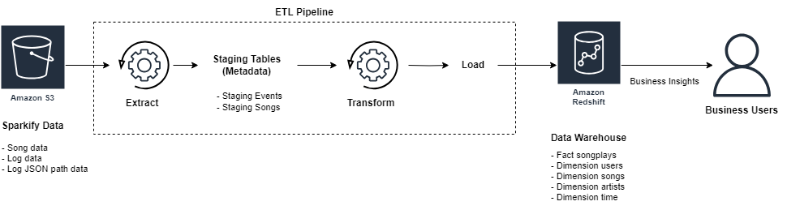
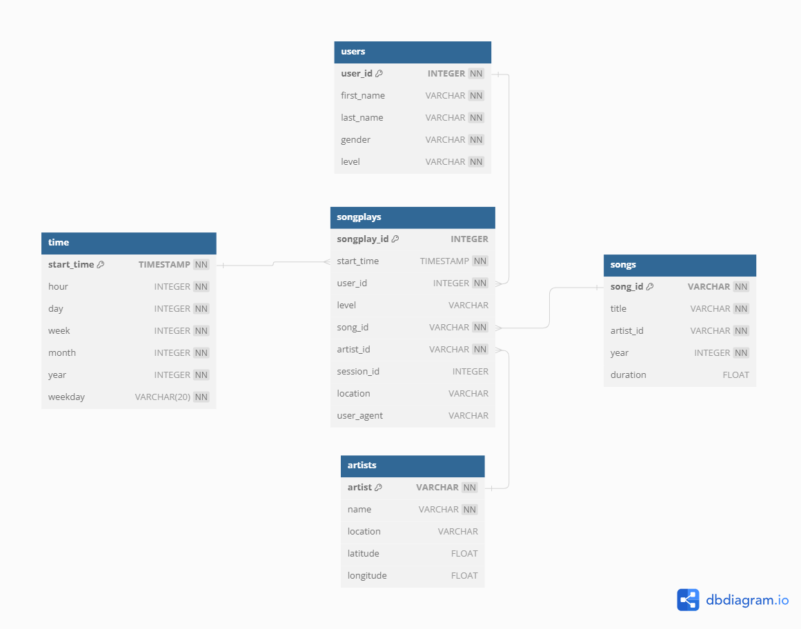

# Sparkify Data Warehouse
This project leverages Infrastructure as Code (IaC) on AWS to build a data warehouse for analyzing user activity on Sparkify by transforming multiple log files into a relational database using Amazon Redshift, which is based on PostgreSQL.

## Business Requirements
- **Cloud Data Migration**
  - Migrate data from S3 to Redshift.
- **ETL Pipeline Development**
  - Extract user activity logs and song metadata from S3 and stage them as tables in Redshift.
  - Transform the extracted data into Amazon Redshift.
  - Load the data into fact and dimension tables using a star schema.
- **Data Quality**
  - Ensure data accuracy and remove duplicates during the ETL process.
- **Performance Optimization**
  - Optimize Redshift tables for fast query performance.
<!-- - **Scalability**
  - Design the ETL pipeline to handle increasing data volumes as Sparkify grows.
- **Security**
  - Secure data in Redshift with encryption and access controls. -->
- **Support for Business Insight**
  - Enable the analytics team to analyze song popularity, user behavior, and peak usage times.

## Architecture Diagram

## Input Data
The input data consists of a set of json files storing information on the song and artist and a second set of json files contain log information on user activity. The data is stored on AWS S3.

## ETL Pipeline
The ETL (Extract, Transform, Load) pipeline is designed to process and transform the raw data stored in AWS S3 into a structured format in Amazon Redshift. The process involves the following steps:

1. **Extract**: 
   - Raw JSON files containing user activity logs and song metadata are extracted from the S3 bucket.
   - The data is then loaded into staging tables in Amazon Redshift. These staging tables act as an intermediate storage before the data is transformed.

2. **Transform**: 
   - The data in the staging tables is cleaned and transformed to fit into the target schema. This includes tasks such as:
     - Parsing timestamps and breaking them down into individual components like hour, day, week, etc.
     - Mapping user IDs to user details.
     - Associating songplays with corresponding songs and artists.
     - Removing duplicates and ensuring data consistency.

    **Handling Duplicates and Data Consistency**
    - **Duplicate Records**: The ETL script includes checks to avoid inserting duplicate records into the fact and dimension tables. For instance:
        - During the transformation phase, the `INSERT` statements use `DISTINCT` to ensure that only unique records are loaded into the tables.
        - For the `users` and `songs` tables, the script only inserts records where the `user_id` or `song_id` is not already present in the table.
    - **Data Consistency**: 
        - The ETL script ensures that all foreign key relationships between the fact table and the dimension tables are maintained. For example, the `songplays` table is populated with data from both the `staging_events` and `staging_songs` tables, ensuring that each songplay is correctly linked to its respective song and artist.
        - The script also validates and cleanses the data during the transformation step to ensure that no malformed or incomplete records are loaded into the final tables.


3. **Load**: 
   - After the transformation, the clean data is loaded into the fact and dimension tables designed in a star schema format.
   - The final tables are optimized for query performance, enabling efficient analysis of user activity, song popularity, and other business metrics.


## STAR Schema Design
The STAR schema consists of one fact table (songplays) and four dimension tables (users, songs, artists, time).



- **Fact Table**
  - `songplays` - Records in event data associated with song plays (i.e., records with page NextSong).
    - Columns: `songplay_id`, `start_time`, `user_id`, `level`, `song_id`, `artist_id`, `session_id`, `location`, `user_agent`
- **Dimension Tables**
  - `users` - Users in the app.
    - Columns: `user_id`, `first_name`, `last_name`, `gender`, `level`
  - `songs` - Songs in music database.
    - Columns: `song_id`, `title`, `artist_id`, `year`, `duration`
  - `artists` - Artists in music database.
    - Columns: `artist_id`, `name`, `location`, `latitude`, `longitude`
  - `time` - Timestamps of records in songplays broken down into specific units.
    - Columns: `start_time`, `hour`, `day`, `week`, `month`, `year`, `weekday`

## How To Run
1. **Create IAM User and Key and Secret:**
   - Go to [AWS IAM service](https://console.aws.amazon.com/iam/home#/users) and click on the "**Add user**" button to create a new IAM user in your AWS account.
   - Choose a name of your choice.
   - Select "*Programmatic access*" as the access type, then click Next.
   - Under the *Attach existing policies directly* tab, select "**AdministratorAccess**", then click Next.
   - Skip adding any tags, then click Next.
   - Review and create the user. Note the access key ID and secret, which you will need later.

2. **Create `.env` and Fill in Key and Secret Information:**
   - Create a `.env` file in the project directory and add your AWS credentials:
     ```bash
     KEY=[WRITE HERE]
     SECRET=[WRITE HERE]
     ```

3. **Install Dependencies:**
   - Install the required packages and activate the environment using conda:
     ```bash
     conda env create -f environment.yml 
     conda activate de-aws
     ```
   - Or using `pip` with python 3.11.9:
     ```bash
     pip install -r requirements.txt 
     ```

4. **Create Redshift Cluster:**
   - Run the script to create the Redshift cluster:
     ```bash
     python create_cluster.py
     ```
     This will automatically adding `dwh_endpoint` and `dwh_arn_role` inside `dwh.cfg`.

5. **Create Tables:**
   - Run the script to create the tables in Redshift:
     ```bash
     python create_tables.py
     ```

6. **Run ETL Pipeline:**
   - Execute the ETL pipeline to load data into the tables:
     ```bash
     python etl.py
     ```

7. **See Business Insights:**
   - Run the script to execute queries for business insights:
     ```bash
     python business_insights.py
     ```

8. **Destroy Redshift Cluster:**
   - Run the script to clean up and delete the Redshift cluster:
     ```bash
     python destroy_cluster.py
     ```

