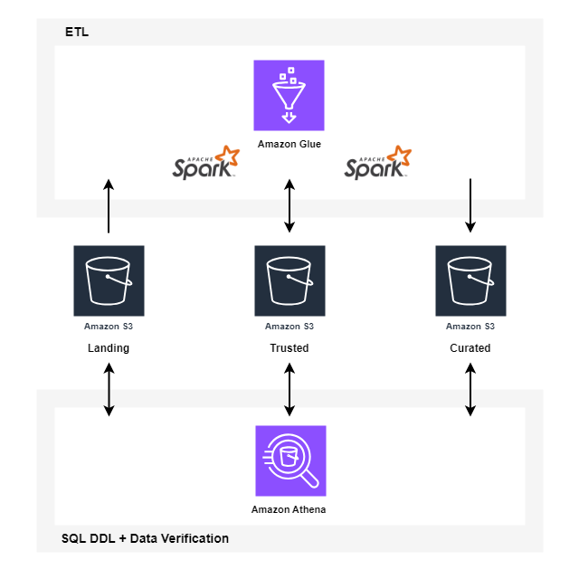

# STEDI Human Balance Analytics

**Overview:**
This project focuses on building a data lakehouse solution using AWS Glue, S3, Athena, Python, and Spark to process and curate sensor data from the STEDI Step Trainer. The goal is to prepare the data for machine learning model training, ensuring data privacy and compliance with regulations like GDPR.

**Project Objectives:**
- Ingest, process, and curate sensor data from STEDI Step Trainers and mobile apps.
- Create trusted and curated datasets for machine learning model training.
- Anonymize and sanitize customer data to remove personally identifiable information (PII).

**Diagram Architure:**



**Data Sources:**
1. **Customer Records**:
   - **Fields**: `serialnumber`, `sharewithpublicasofdate`, `birthday`, `registrationdate`, `sharewithresearchasofdate`, `customername`, `email`, `lastupdatedate`, `phone`, `sharewithfriendsasofdate`

2. **Step Trainer Records**:
   - **Fields**: `sensorReadingTime`, `serialNumber`, `distanceFromObject`

3. **Accelerometer Records**:
   - **Fields**: `timeStamp`, `user`, `x`, `y`, `z`

**Project Workflow:**
1. **Landing Zone**:
   - Ingest data from S3 sources using AWS Glue.
   - Create Glue Tables using SQL DDL scripts (e.g., `customer_landing.sql`, `accelerometer_landing.sql`).
   - Query the landing tables in Athena to verify data ingestion.

2. **Trusted Zone**:
   - Create Glue Jobs to sanitize and filter the data:
     - **customer_landing_to_trusted.py**: Filters customers who agreed to share data for research.
     - **accelerometer_landing_to_trusted.py**: Filters accelerometer data for customers who agreed to share data.
     - **step_trainer_trusted.py**: Joins step trainer data with the sanitized customer data.
   - Query the trusted tables in Athena to verify data accuracy.

3. **Curated Zone**:
   - Further process the trusted data:
     - **customer_trusted_to_curated.py**: Creates a curated customer dataset with customers who have associated accelerometer data.
     - **accelerometer_trusted_to_curated.py**: Filters the accelerometer data to include only readings that occurred after the customer provided consent for research.
     - **machine_learning_curated.py**: Joins step trainer and accelerometer data based on timestamps to create a machine learning training dataset.
   - Anonymize PII before storing the final curated datasets. Sensitive information such as `customerName`, `email`, and `phone` is hashed to protect customer privacy in the curated data.

**Key Outputs:**
- **Customer Curated Data**: Contains sanitized customer records with associated accelerometer data.
- **Machine Learning Curated Data**: Aggregates step trainer readings with matching accelerometer data for machine learning.

**How to Run the Project:**
1. Upload the data from the starter directory to the appropriate landing zones in your S3 bucket.
1. Use the provided SQL scripts to create Glue tables for the landing zones.
1. Run the Glue Jobs to process the data through the Landing, Trusted, and Curated zones.
1. Query the data in Athena and verify the row counts as per the expected output.
1. Review the anonymized datasets in the Curated zone to ensure compliance with privacy regulations.

**Screenshots and Verification:**
- Include screenshots showing query results from Athena for each stage (Landing, Trusted, Curated).
- Verify the row counts in each table to match the expected values:
  - **Landing Zone**: Customer (956), Accelerometer (81273), Step Trainer (28680)
  - **Trusted Zone**: Customer (482), Accelerometer (40981), Step Trainer (14460)
  - **Curated Zone**: Customer (482), Machine Learning (43681)

**Repository Structure:**
``` plaintext
.
├── README.md
├── scripts # Python scripts for Glue jobs
│   ├── accelerometer_landing_to_trusted.py
│   ├── accelerometer_trusted_to_curated.py
│   ├── customer_landing_to_trusted.py
│   ├── customer_trusted_to_curated.py
│   ├── machine_learning_curated.py
│   └── step_trainer_trusted.py
├── sql_queries # SQL scripts for creating Glue tables
│   ├── accelerometer_landing.sql
│   ├── customer_landing.sql
│   └── step_trainer_landing.sql
├── assets
│   ├── diagrams
│   │   └── stedi-lake-house-diagram.png
│   └── screenshots
│       ├── accelerometer_landing_count.PNG
│       ├── accelerometer_trusted_count.PNG
│       ├── customer_curated_count.PNG
│       ├── customer_landing_count.PNG
│       ├── customer_landing_sharewithresearchasofdate_null.PNG
│       ├── customer_trusted_count.PNG
│       ├── machine_learning_curated_count.PNG
│       ├── step_trainer_landing_count.PNG
│       └── step_trainer_trusted_count.PNG
└── starter # starter data for landing zone
    ├── README.md
    ├── accelerometer
    │   └── landing
    ├── customer
    │   └── landing
    └── step_trainer
        └── landing
```
